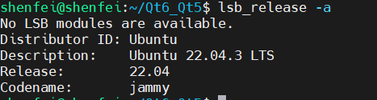

在Ubuntu版本中使用需要先 将环境变量写入.bashrc中

echo 'export QTDIR=/path/to/qt' >> ~/.bashrc

source ~/.bashrc

上述/path/to/qt为Qt实际安装路径，目前测试过Ubuntu 22.04.3 LTS版本。

example:
先执行
echo 'export QTDIR=/opt/Qt/5.15.2/gcc_64/lib/cmake/Qt5' >> ~/.bashrc

source ~/.bashrc

再 export 查看路径

